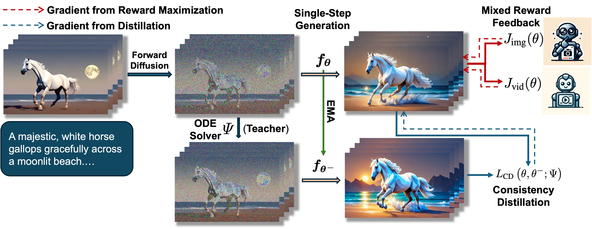
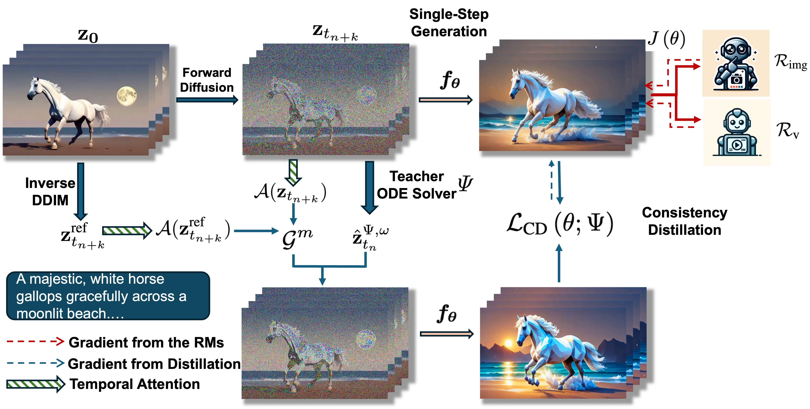

# <span style="font-family: 'Courier New', monospace; font-weight: bold">T2V-Turbo</span>
This repository provides the official implementation of <span style="font-family: 'Courier New', monospace; font-weight: bold">T2V-Turbo</span> and <span style="font-family: 'Courier New', monospace; font-weight: bold">T2V-Turbo-v2</span> from the following papers.

**T2V-Turbo: Breaking the Quality Bottleneck of Video Consistency Model with Mixed Reward Feedback**  
Jiachen Li, Weixi Feng, Tsu-Jui Fu, Xinyi Wang, Sugato Basu, Wenhu Chen, William Yang Wang

Paper: https://arxiv.org/abs/2405.18750

Project Page: https://t2v-turbo.github.io/



**T2V-Turbo-v2: Enhancing Video Model Post-Training through Data, Reward, and Conditional Guidance Design**  
Jiachen Li, Qian Long, Jian Zheng, Xiaofeng Gao, Robinson Piramuthu, Wenhu Chen, William Yang Wang

Paper: (Coming Soon)

Project Page: https://t2v-turbo-v2.github.io/



## 🔔 News
[10.09.2024] Release the training and inference codes for T2V-Turbo-v2.

[06.24.2024] Release the training codes for T2V-Turbo (VC2).

## Fast and High-Quality Text-to-video Generation 🚀

### 16-Step Results of T2V-Turbo-v2

<table class="center">
  <td></td></td>
  <td></td></td>
  <td></td></td></td>
  <tr>
  <td style="text-align:center;" width="320">light wind, feathers moving, she moves her gaze</td>
  <td style="text-align:center;" width="320">Pikachu snowboarding</td>
  <td style="text-align:center;" width="320">A musician strums his guitar, serenading the moonlit night</td>
  <tr>
</table >

<table class="center">
  <td></td></td>
  <td></td></td>
  <td></td></td>

  <tr>
  <td style="text-align:center;" width="320">camera pan from left to right, a man wearing sunglasses and business suit</td>
  <td style="text-align:center;" width="320">Pikachu snowboarding</td>
  <td style="text-align:center;" width="320">a girl floating underwater </td>
  <tr>
</table >

### 4-Step Results of T2V-Turbo

[](https://replicate.com/chenxwh/t2v-turbo) 

<table class="center">
  <td></td></td>
  <td></td></td>
  <td></td></td></td>
  <tr>
  <td style="text-align:center;" width="320">With the style of low-poly game art, A majestic, white horse gallops gracefully across a moonlit beach.</td>
  <td style="text-align:center;" width="320">medium shot of Christine, a beautiful 25-year-old brunette resembling Selena Gomez, anxiously looking up as she walks down a New York street, cinematic style</td>
  <td style="text-align:center;" width="320">a cartoon pig playing his guitar, Andrew Warhol style</td>
  <tr>
</table >

<table class="center">
  <td></td></td>
  <td></td></td>
  <td></td></td>

  <tr>
  <td style="text-align:center;" width="320">a dog wearing vr goggles on a boat</td>
  <td style="text-align:center;" width="320">Pikachu snowboarding</td>
  <td style="text-align:center;" width="320">a girl floating underwater </td>
  <tr>
</table >

### 8-Step Results of T2V-Turbo

[](https://replicate.com/chenxwh/t2v-turbo) 

<table class="center">
  <td></td></td>
  <td></td></td>
  <td></td></td></td>
  <tr>
  <td style="text-align:center;" width="320">Mickey Mouse is dancing on white background</td>
  <td style="text-align:center;" width="320">light wind, feathers moving, she moves her gaze, 4k</td>
  <td style="text-align:center;" width="320">fashion portrait shoot of a girl in colorful glasses, a breeze moves her hair </td>
  <tr>
</table >

<table class="center">
  <td></td></td>
  <td></td></td>
  <td></td></td>

  <tr>
  <td style="text-align:center;" width="320">With the style of abstract cubism, The flowers swayed in the gentle breeze, releasing their sweet fragrance.</td>
  <td style="text-align:center;" width="320">impressionist style, a yellow rubber duck floating on the wave on the sunset</td>
  <td style="text-align:center;" width="320">A Egyptian tomp hieroglyphics painting ofA regal lion, decked out in a jeweled crown, surveys his kingdom.</td>
  <tr>
</table >

## 🏭 Installation

```
pip install accelerate transformers diffusers webdataset loralib peft pytorch_lightning open_clip_torch==2.24.0 hpsv2 image-reward peft wandb av einops packaging omegaconf opencv-python kornia moviepy imageio

pip install flash-attn --no-build-isolation
git clone https://github.com/Dao-AILab/flash-attention.git
cd flash-attention
pip install csrc/fused_dense_lib csrc/layer_norm

conda install xformers -c xformers
```
## 🛞 Model Checkpoints

|Model|Resolution|Checkpoints|
|:---------|:---------|:--------|
|T2V-Turbo-v2 w/ MG|320x512|[](https://huggingface.co/jiachenli-ucsb/T2V-Turbo-v2/blob/main/unet_mg.pt)
|T2V-Turbo-v2 w/o MG|320x512|[](https://huggingface.co/jiachenli-ucsb/T2V-Turbo-v2-no-MG/blob/main/unet_no_mg.pt)
|T2V-Turbo (VC2)|320x512|[](https://huggingface.co/jiachenli-ucsb/T2V-Turbo-VC2/blob/main/unet_lora.pt)
|T2V-Turbo (MS)|256x256|[](https://huggingface.co/jiachenli-ucsb/T2V-Turbo-MS/blob/main/unet_lora.pt)


## 🚀 Inference

We provide local demo codes supported with gradio (For MacOS users, need to set the device="mps" in app.py; For Intel GPU users, set device="xpu" in app.py). Please install gradio
```python
pip install gradio==3.48.0
```
And Download the model checkpoint of [VideoCrafter2](https://huggingface.co/VideoCrafter/VideoCrafter2/blob/main/model.ckpt).

### T2V-Turbo-v2

> To play with our T2V-Turbo-v2:

1. Download the [unet_mg.pt](https://huggingface.co/jiachenli-ucsb/T2V-Turbo-VC2-no-MG/blob/main/unet_no_mg.pt) of our T2V-Turbo-v2.


2. Launch the gradio demo with the following command:
```python
python app.py \
  --unet_dir unet_mg.pt PATH_TO_VideoCrafter2_MODEL_CKPT \
  --base_model_dir PATH_TO_VideoCrafter2_MODEL_CKPT \
  --version v2 \
  --motion_gs 0.0
```

> We also provide the unet trained without augmenting teacher ODE solver with guidance. To play with it, please follow the steps below:

1. Download the [unet_no_mg.pt](https://huggingface.co/jiachenli-ucsb/T2V-Turbo-v2/blob/main/unet_mg.pt) of our T2V-Turbo-v2.


2. Launch the gradio demo with the following command:
```python
python app.py \
  --unet_dir unet_mg.pt PATH_TO_VideoCrafter2_MODEL_CKPT \
  --base_model_dir PATH_TO_VideoCrafter2_MODEL_CKPT \
  --version v2 \
  --motion_gs 0.0
```


### T2V-Turbo
> To play with our T2V-Turbo (VC2), please follow the steps below:

1. Download the `unet_lora.pt` of our T2V-Turbo (VC2) [here](https://huggingface.co/jiachenli-ucsb/T2V-Turbo-VC2/blob/main/unet_lora.pt).

2. Launch the gradio demo with the following command:
```python
python app.py \
  --unet_dir PATH_TO_UNET_LORA.pt \
  --base_model_dir PATH_TO_VideoCrafter2_MODEL_CKPT \
  --version v1
```

> To play with our T2V-Turbo (MS), please follow the steps below:

1. Download the `unet_lora.pt` of our T2V-Turbo (MS) [here](https://huggingface.co/jiachenli-ucsb/T2V-Turbo-MS/blob/main/unet_lora.pt).

2. Launch the gradio demo with the following command:
```python
python app_ms.py --unet_dir PATH_TO_UNET_LORA.pt
```


## 🏋️ Training

### T2V-Turbo-v2

Run the following command:
```
bash train_t2v_turbo_v2.sh
```

### T2V-Turbo
To train T2V-Turbo (VC2), first prepare the data and model as below
1. Download the model checkpoint of VideoCrafter2 [here](https://huggingface.co/VideoCrafter/VideoCrafter2/blob/main/model.ckpt).
2. Prepare the [WebVid-10M](https://github.com/m-bain/webvid) data. Save in the `webdataset` format.
3. Download the [InternVid2 S2 Model](https://huggingface.co/OpenGVLab/InternVideo2-CLIP-1B-224p-f8) 
4. Set `--pretrained_model_path`, `--train_shards_path_or_url` and `video_rm_ckpt_dir` accordingly in `train_t2v_turbo_vc2.sh`.

Then run the following command:
```
bash train_t2v_turbo_v1.sh
```
